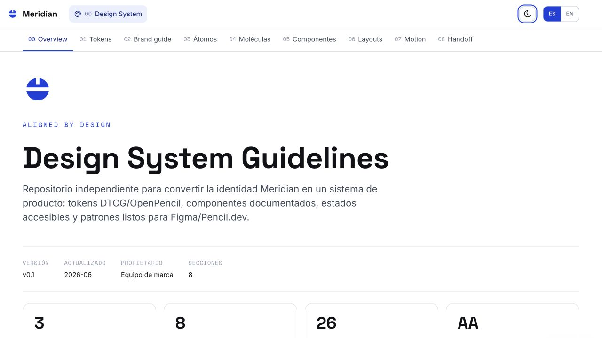
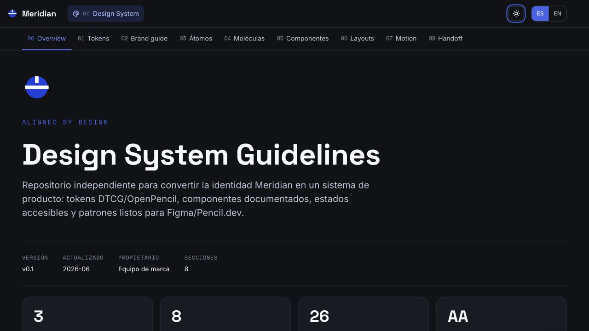

# Meridian — Design System Guidelines (plantilla)

[](https://dmxstudio.github.io/dmx-web-design-system-guidelines-template/) [](./LICENSE)

**Ver demo en vivo -> https://dmxstudio.github.io/dmx-web-design-system-guidelines-template/**

| Modo claro | Modo oscuro |
|:----------:|:-----------:|
|  |  |

Plantilla profesional de *design system guidelines*, **bilingüe (ES/EN), responsive, accesible y lista para handoff**, construida en **HTML + CSS + JS estático**. Marca demo ficticia: **Meridian** ("Aligned by design").

Este repo es el entregable de sistema de diseño de producto. El brand book se usa como fuente de identidad; no se copia ni se edita desde aquí.

---

## De un vistazo

- **8 secciones auditables** · 3 capas de tokens · 129 tokens · 26 ejemplos `data-component`
- **Bilingüe ES/EN** con toggle persistido en `localStorage`
- **Tokens DTCG** con metadata Figma y extensiones OpenPencil
- **Modo claro/oscuro** por tokens semánticos, sin invertir assets de marca
- **Componentes documentados** con estados `default`, `hover`, `focus`, `disabled`, `loading` y `error`
- **Accesibilidad AA**: contraste por estado, foco visible, ARIA y soporte `prefers-reduced-motion`

## Stack y cómo correr

Estático y portable:

```bash
npm run build
npm run serve
```

Abre `http://localhost:4174`.

## Estructura de archivos

```text
design-system-guidelines/
  index.html                         documentación visual
  design-tokens.json                 contrato DTCG + Figma + OpenPencil
  assets/
    app.js                           tema, navegación, copy, ES/EN
    styles.css                       tokens CSS + componentes
    meridian-logo.svg                marca Meridian
    img/                             screenshots para README
  schemas/
    design-tokens.schema.json        contrato local de validación
  scripts/
    validate-design-system.mjs       build gate determinista
```

## Arquitectura de tokens

`Primitive -> Semantic -> Component`

- **Primitive:** color brand/neutral, tipografía, espacio, radio, shadow, motion y z-index.
- **Semantic:** roles de interfaz para fondo, superficie, texto, borde, acción, foco y status.
- **Component:** decisiones por UI para botones, campos, badges, tarjetas, modales y navegación.

El archivo [`design-tokens.json`](./design-tokens.json) está preparado para importación a Figma y para parsers compatibles con DTCG/OpenPencil.

## Sistema documentado

La guía convierte las secciones UI del brand guidelines en reglas operativas:

- Color, tipografía, accesibilidad, dark mode e iconografía
- Átomos: color, type, space, shape, depth, icon, border y opacity
- Moléculas: buttons, fields, tabs y alerts
- Componentes: cards, modal, table/token audit y checklist
- Layouts: dashboard, editorial, form y breakpoints
- Motion, z-index, states y handoff

## Validación

`npm run build` comprueba:

- Sintaxis de JavaScript
- Existencia de HTML, CSS, schema y tokens
- JSON válido
- `$type` requerido en tokens con `$value`
- Resolución de aliases
- Metadata Figma/OpenPencil obligatoria
- Secciones requeridas y ejemplos `data-component`

## Navegación e interacción

- Top-nav + sub-navegación sticky con scrollspy
- Toggle ES/EN persistido en `localStorage`
- Toggle light/dark con anti-FOUC
- Botones de copia con toast accesible
- Botón de volver arriba y paginación de footer
- Movimiento respetando `prefers-reduced-motion`

## Licencia

© 2026 **DMX Studio**. Publicado bajo **Creative Commons Attribution-NonCommercial 4.0 International (CC BY-NC 4.0)** — texto completo en [`LICENSE`](./LICENSE).

- Libre de usar, copiar y adaptar con atribución a DMX Studio.
- No comercial: no se permite vender el template ni usarlo con fines comerciales sin permiso y remuneración previa.
- ¿Uso comercial o licencia a medida? Escríbenos a **designomexico@gmail.com**.

`SPDX-License-Identifier: CC-BY-NC-4.0`

---

_Versión de contenido: v0.1 · design tokens DTCG · bilingüe ES/EN._
